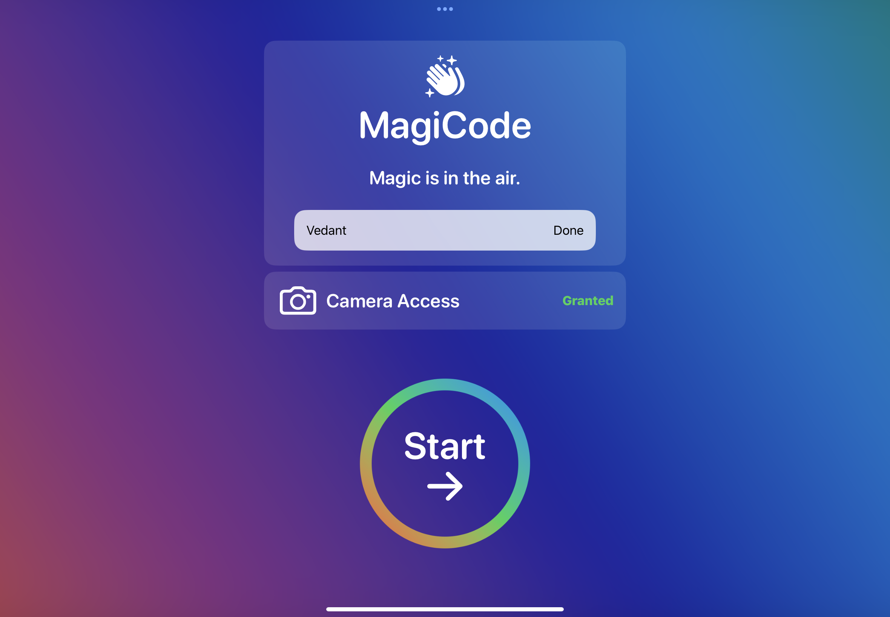

# MagiCode
My submission for the WWDC24 Swift Student Challenge!

## Status
[Accepted - Distinguished!](https://twitter.com/vedantapps/status/1773399446413545627) 

## Demo
[Demo Video](https://youtu.be/ExdPPtEwrPU) 

## The Project
- Help the Apple team out by compiling the latest update.
- 7 total 'mini-apps' (Countdown, MagicDraw, Messages, CodeEdit, Photos, App Info, and Settings).
- visionOS inspired experience with full hand tracking support. Pinch your index finger and thumb together to select.
- MagiCode is powered by SwiftUI, Vision, and PencilKit.

## Screenshots

  
  
  
  
  
  

